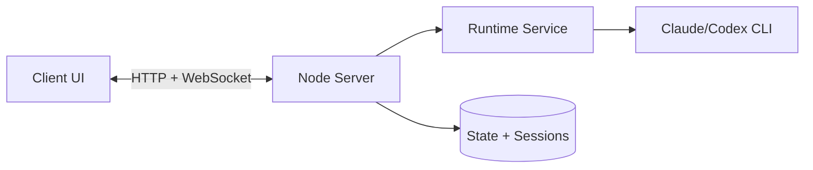
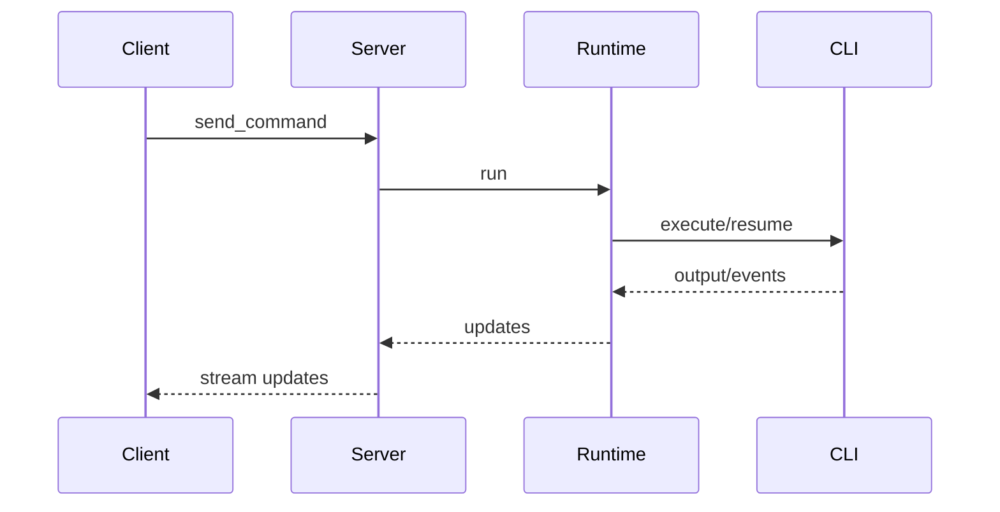
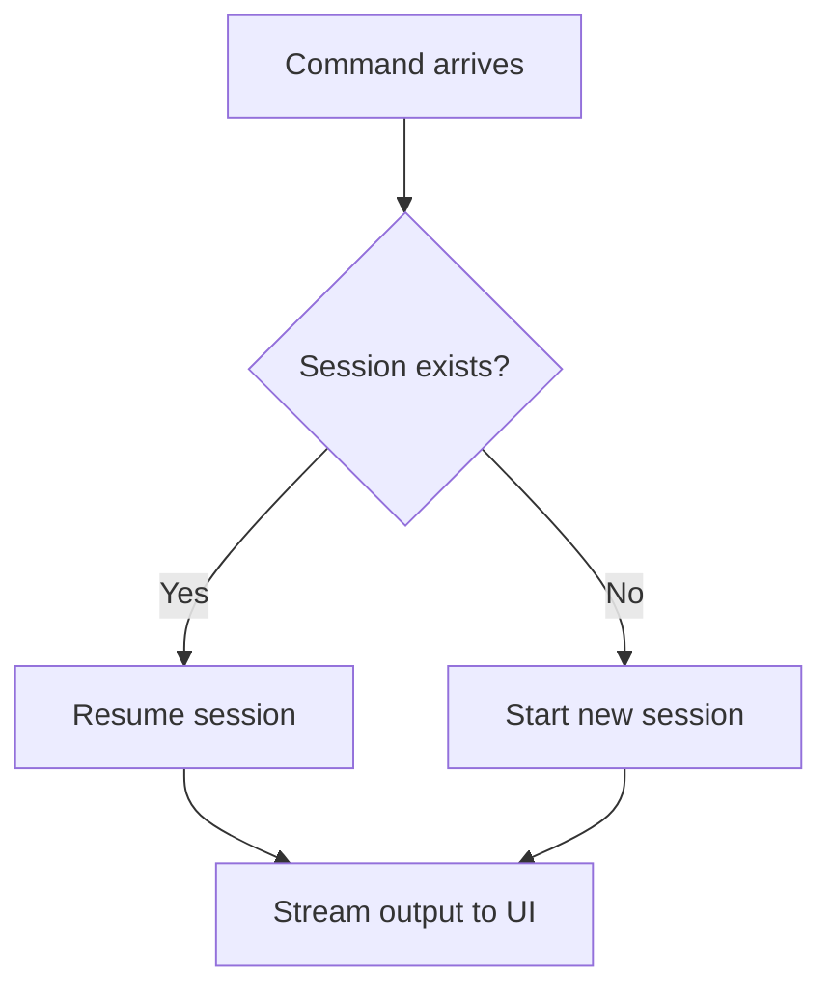

# Architecture

This document describes Tide Commander's current runtime architecture and a practical path to improve it incrementally.

## System Overview

## Command Execution Flow

## Session Resume (Current Behavior)

## Architecture Improvements

These are high-impact, low-risk improvements aligned with current code shape.

### 1) Introduce a Typed Domain Event Bus

Current event flow is spread across runtime callbacks and WebSocket broadcasts. Add a lightweight internal event bus to normalize events (`command_started`, `tool_started`, `permission_pending`, `permission_resolved`, `session_resumed`).

Benefits:
- clearer ownership boundaries
- easier replay/debug tooling
- reduced coupling between runtime and websocket layers

### 2) Separate Runtime Orchestration From State Mutation

`runtime-service.ts` currently handles orchestration plus state updates and recovery logic. Split into:
- `runtime-orchestrator` (execution, retries, recovery)
- `agent-runtime-state` (status/context/session mutations)

Benefits:
- smaller test surface per module
- easier extension for new providers
- less regression risk in recovery paths

### 3) Standardize Provider Capabilities

Define a capability contract per provider:
- `supportsStdin`
- `supportsResume`
- `supportsStructuredUsage`
- `supportsPermissionHooks`

Benefits:
- fewer provider-specific branches
- cleaner onboarding for future providers

### 4) Add Unified Correlation IDs

Generate a correlation ID per command turn and propagate across:
- websocket events
- runtime logs
- permission requests

Benefits:
- faster debugging across asynchronous paths
- better observability for stuck/timeout investigations

### 5) Harden Permission-Request Persistence

`pendingRequests` is in-memory. Introduce optional persistence for pending approvals and deterministic recovery after server restart.

Benefits:
- better resilience in interactive mode
- fewer accidental denials on process restarts

## Suggested Incremental Plan

1. Add typed internal events and correlation IDs.
2. Extract runtime state mutation from orchestration.
3. Add provider capability matrix and prune conditionals.
4. Add optional persistence for pending permissions.
