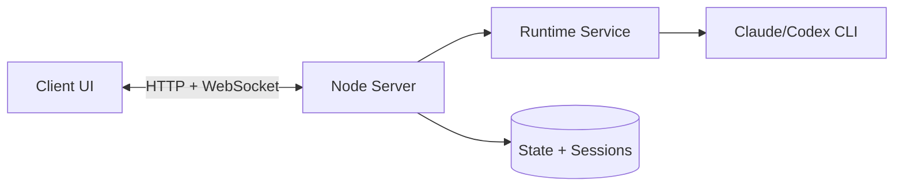
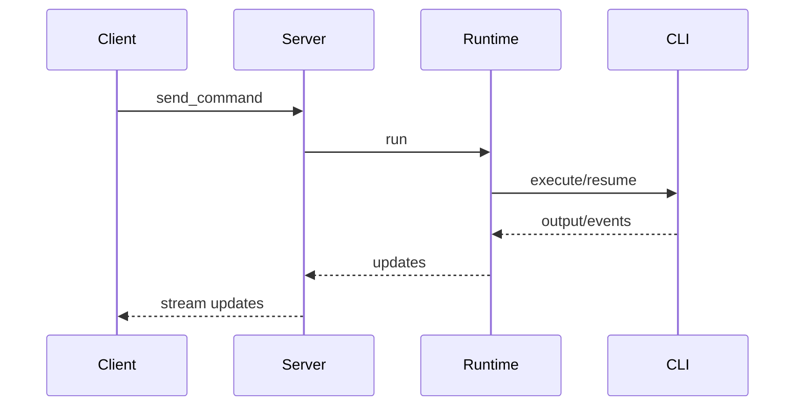
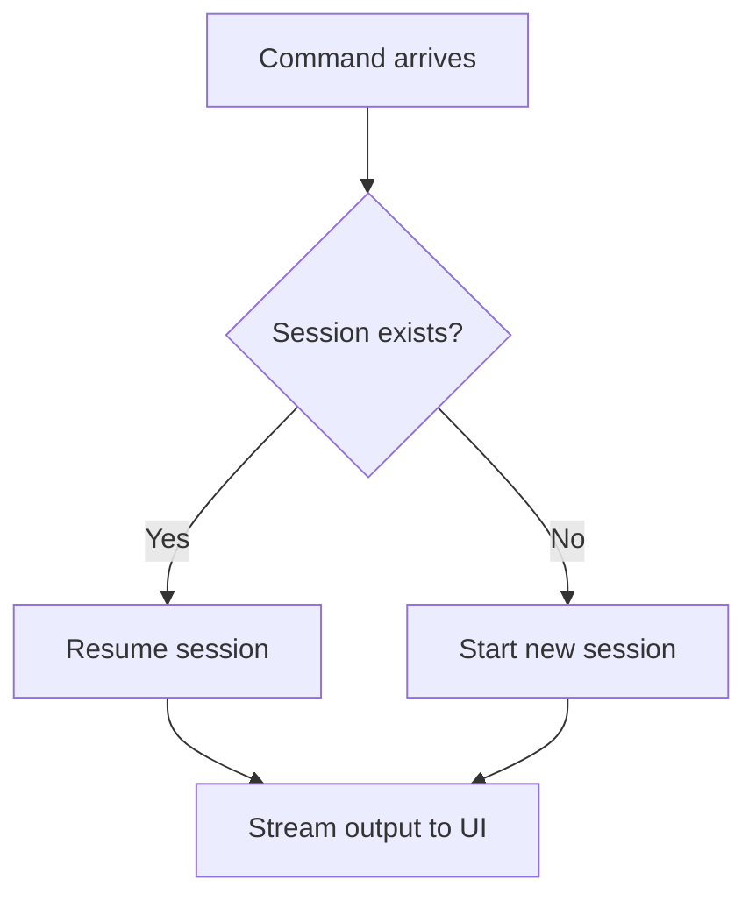

# Architecture

This document describes Tide Commander's current runtime architecture and a practical path to improve it incrementally.

## System Overview


```mermaid
flowchart LR
  UI[Client UI] <-->|HTTP + WebSocket| SERVER[Node Server]
  SERVER --> RUNTIME[Runtime Service]
  RUNTIME --> CLI[Claude/Codex CLI]
  SERVER --> DATA[(State + Sessions)]
```

## Command Execution Flow


```mermaid
sequenceDiagram
  participant UI as Client
  participant SERVER as Server
  participant RUNTIME as Runtime
  participant CLI as CLI

  UI->>SERVER: send_command
  SERVER->>RUNTIME: run
  RUNTIME->>CLI: execute/resume
  CLI-->>RUNTIME: output/events
  RUNTIME-->>SERVER: updates
  SERVER-->>UI: stream updates
```

## Session Resume (Current Behavior)


```mermaid
flowchart TD
  A[Command arrives] --> B{Session exists?}
  B -->|Yes| C[Resume session]
  B -->|No| D[Start new session]
  C --> E[Stream output to UI]
  D --> E
```

## Project Structure Diagram

```mermaid
flowchart TD
    %% Entry Points (nodes outside subgraphs)
    A[HTTP Server] -->|Express| AppEntry
    B[CLI] -->|bun| CliEntry

    subgraph "Server Package"
        S[Server] -->|routes| RoutesGrp
        S -->|services| ServicesGrp
        S -->|data| DataGrp
        S -->|utils| UtilsGrp
    end

    subgraph "Routes"
        R1[API Routes] -->|auth| AuthGrp
        R1 -->|cad| CadGrp
        R1 -->|grok| GrokGrp
        R1 -->|codex| CodexGrp
    end

    subgraph "Services"
        S1[Core Services] -->|session| SessionLdr
        S1 -->|agent| AgentTypes
        S1 -->|workflow| WrkflGrp
    end

    subgraph "Claude Integration"
        C1[Claude Backend] -->|process| BackendTs
        C1 -->|runner| RunnerTs
        C1 -->|session| SessionLoaderTs
        C1 -->|interactive| Interactive
    end

    subgraph "Runner"
        R2[Process Lifecycle] -->|manage| ProcLifeTs
        R2 -->|restart| RestPolicTs
        R2 -->|monitor| ResMonitorTs
        R2 -->|stdout| StdoutPipeTs
        R2 -->|tmux| TmuxHelperTs
        R2 -->|watchdog| WatchdogTs
        R2 -->|store| RestPolicTs2
    end

    subgraph "Shared Types"
        AT[AgentType Def] -->|defines| ATs
        AT -->|defines| WkflTyp
        AT -->|defines| IntgTyp
        AT -->|defines| ComTyp
        AT -->|defines| DbTyp
        AT -->|building| BuildTyp
        AT -->|cad| CadTyp
        AT -->|http| HttpTyp
        AT -->|version| VersTyp
    end

    subgraph "Data Layer"
        D[Data Mod] -->|config| SetupTs
        D -->|types| DbTyp2
    end

    %% Connections between specific nodes
    A --> S
    B --> CliEntry
    S --> RoutesGrp
    S --> ServicesGrp
    S --> DataGrp
    S --> UtilsGrp
    RoutesGrp --> AuthGrp
    RoutesGrp --> CadGrp
    RoutesGrp --> GrokGrp
    RoutesGrp --> CodexGrp
    ServicesGrp --> SessionLdr
    ServicesGrp --> AgentTypes
    ServicesGrp --> WrkflGrp
    BackendTs --> BackendTs
    RunnerTs --> RunnerTs
    SessionLoaderTs --> SessionLoaderTs
    Interactive --> Interactive
    ProcLifeTs --> ProcLifeTs
    RestPolicTs --> RestPolicTs
    ResMonitorTs --> ResMonitorTs
    StdoutPipeTs --> StdoutPipeTs
    TmuxHelperTs --> TmuxHelperTs
    WatchdogTs --> WatchdogTs
    RestPolicTs2 --> RestPolicTs2
    ATs --> ATs
    WkflTyp --> WkflTyp
    IntgTyp --> IntgTyp
    ComTyp --> ComTyp
    DbTyp --> DbTyp
    BuildTyp --> BuildTyp
    CadTyp --> CadTyp
    HttpTyp --> HttpTyp
    VersTyp --> VersTyp
    SetupTs --> SetupTs
    DbTyp2 --> DbTyp2

    %% Notes
    classDef entry fill:#e1f5fe,stroke:#0b5396,stroke-width:2px;
    classDef subgrp fill:#fff3e0,stroke:#ef6c00,stroke-width:2px;
    classDef nodetype fill:#e8f5e9,stroke:#2e7d32,stroke-width:2px;

    class A,B entry
    class S,RoutesGrp,ServicesGrp,DataGrp,UtilsGrp subgrp
    class ATs,WkflTyp,IntgTyp,ComTyp,DbTyp,BuildTyp,CadTyp,HttpTyp,VersTyp nodetype
"

This diagram illustrates the high-level architecture of Tide Commander, showing the main entry points, server package structure, routes, services, Claude integration, runner subsystem, and shared types that bind everything together.


## Architecture Improvements

These are high-impact, low-risk improvements aligned with current code shape.

### 1) Introduce a Typed Domain Event Bus

Current event flow is spread across runtime callbacks and WebSocket broadcasts. Add a lightweight internal event bus to normalize events (`command_started`, `tool_started`, `permission_pending`, `permission_resolved`, `session_resumed`).

Benefits:
- clearer ownership boundaries
- easier replay/debug tooling
- reduced coupling between runtime and websocket layers

### 2) Separate Runtime Orchestration From State Mutation

`runtime-service.ts` currently handles orchestration plus state updates and recovery logic. Split into:
- `runtime-orchestrator` (execution, retries, recovery)
- `agent-runtime-state` (status/context/session mutations)

Benefits:
- smaller test surface per module
- easier extension for new providers
- less regression risk in recovery paths

### 3) Standardize Provider Capabilities

Define a capability contract per provider:
- `supportsStdin`
- `supportsResume`
- `supportsStructuredUsage`
- `supportsPermissionHooks`

Benefits:
- fewer provider-specific branches
- cleaner onboarding for future providers

### 4) Add Unified Correlation IDs

Generate a correlation ID per command turn and propagate across:
- websocket events
- runtime logs
- permission requests

Benefits:
- faster debugging across asynchronous paths
- better observability for stuck/timeout investigations

### 5) Harden Permission-Request Persistence

`pendingRequests` is in-memory. Introduce optional persistence for pending approvals and deterministic recovery after server restart.

Benefits:
- better resilience in interactive mode
- fewer accidental denials on process restarts

## Suggested Incremental Plan

1. Add typed internal events and correlation IDs.
2. Extract runtime state mutation from orchestration.
3. Add provider capability matrix and prune conditionals.
4. Add optional persistence for pending permissions.


## Architecture Improvements

These are high-impact, low-risk improvements aligned with current code shape.

### 1) Introduce a Typed Domain Event Bus

Current event flow is spread across runtime callbacks and WebSocket broadcasts. Add a lightweight internal event bus to normalize events (`command_started`, `tool_started`, `permission_pending`, `permission_resolved`, `session_resumed`).

Benefits:
- clearer ownership boundaries
- easier replay/debug tooling
- reduced coupling between runtime and websocket layers

### 2) Separate Runtime Orchestration From State Mutation

`runtime-service.ts` currently handles orchestration plus state updates and recovery logic. Split into:
- `runtime-orchestrator` (execution, retries, recovery)
- `agent-runtime-state` (status/context/session mutations)

Benefits:
- smaller test surface per module
- easier extension for new providers
- less regression risk in recovery paths

### 3) Standardize Provider Capabilities

Define a capability contract per provider:
- `supportsStdin`
- `supportsResume`
- `supportsStructuredUsage`
- `supportsPermissionHooks`

Benefits:
- fewer provider-specific branches
- cleaner onboarding for future providers

### 4) Add Unified Correlation IDs

Generate a correlation ID per command turn and propagate across:
- websocket events
- runtime logs
- permission requests

Benefits:
- faster debugging across asynchronous paths
- better observability for stuck/timeout investigations

### 5) Harden Permission-Request Persistence

`pendingRequests` is in-memory. Introduce optional persistence for pending approvals and deterministic recovery after server restart.

Benefits:
- better resilience in interactive mode
- fewer accidental denials on process restarts

## Suggested Incremental Plan

1. Add typed internal events and correlation IDs.
2. Extract runtime state mutation from orchestration.
3. Add provider capability matrix and prune conditionals.
4. Add optional persistence for pending permissions.
