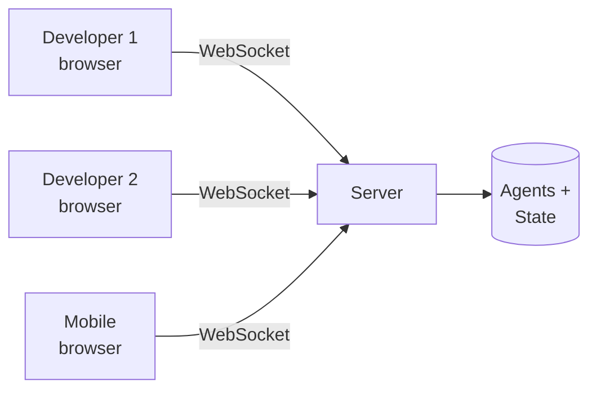

import { Aside } from '@astrojs/starlight/components';

Tide Commander's server is multi-user by design. Multiple browsers can connect to the same instance and see the same agents, the same 3D scene, and the same conversation history — in real time, via WebSocket.

## How it works

The Tide Commander server maintains a single canonical state for all agents, buildings, and areas. Every connected client subscribes to a WebSocket that broadcasts state changes as they happen. When Agent A finishes a turn, all connected clients see the new message appear simultaneously.

There is no concept of "rooms" or "sessions" per user — all connected users share the same workspace. Think of it less like Google Docs and more like a shared terminal: whoever sends a message to an agent sends it for everyone.

## Accessing from multiple devices

Any device on the same network can reach the server at `http://<server-ip>:5174` (or whatever port is configured). For access over the internet, see [HTTPS & Auth](/configuration/https-and-auth/).

The most common pattern is a desktop machine running the server and agents, with a phone or tablet used to monitor progress and send occasional commands.

<Aside type="tip" title="Mobile APK">
An Android APK build of the Tide Commander client is available for a more native mobile experience. See [Android Deployment](/deployment/android/).
</Aside>

## Authentication

All API and WebSocket requests are gated by a bearer token (`X-Auth-Token` header or `token` query parameter). Without the correct token, connections are rejected. Set the token in `.env` as `AUTH_TOKEN=your-secret-value`, or generate one automatically with `tide-commander --generate-auth-token`.

## Concurrent edits

There is no conflict resolution for concurrent users sending commands to the same agent simultaneously. The agent processes messages in the order they arrive. If two users send to the same agent at nearly the same time, both messages will queue and execute sequentially.

A practical convention for teams: designate one Boss agent per project that the whole team talks to, and let the Boss delegate to subordinates. This naturally serialises coordination through a single channel.

<Aside type="note" title="Multiplayer is network-local first">
Multiplayer works best on a local network (home office, shared dev server) or over a VPN. Exposing the server to the public internet requires HTTPS and a strong auth token — see the [HTTPS & Auth](/configuration/https-and-auth/) guide.
</Aside>
