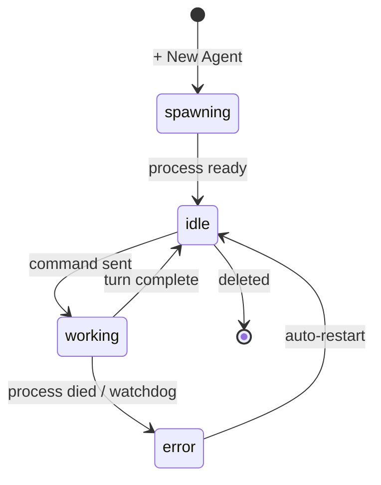

import { Aside, Card, CardGrid } from '@astrojs/starlight/components';

An **agent** is a running CLI process managed by Tide Commander. When you spawn one, the server forks a real subprocess — `claude --output-format stream-json`, `codex exec --experimental-json`, or `opencode run --format json` — and streams its output back to the UI in real time. The character you see on the battlefield is a live handle to that process.

## What an agent has

Every agent carries a fixed set of properties from the moment it's spawned:

| Property | What it is |
|----------|-----------|
| **ID** | Short random string (`abc123`). Used by the API and boss delegation. |
| **Name** | Human-readable label you assign. |
| **Working directory** | The `cwd` the subprocess runs in. File reads and writes happen relative to this path. |
| **Provider** | Which CLI is running: `claude`, `codex`, or `opencode`. |
| **Class** | Visual identity + default instructions + default skills. |
| **Session ID** | The underlying CLI session. Survives server restarts and can be resumed. |
| **Context meter** | How much of the model's context window is currently consumed (the "mana bar"). |

## Lifecycle

An agent moves through four states:

Tide Commander's watchdog monitors the subprocess. If the tmux session dies unexpectedly, it auto-restarts the agent (up to three attempts) and resumes the same session so no context is lost.

## Session resume

CLI sessions are stored on disk by the provider — Claude Code at `~/.claude/projects/`, Codex similarly. When an agent restarts, Tide Commander passes `--resume <sessionId>` so the model receives the full prior conversation. You can close the UI, reboot the machine, and resume exactly where you left off.

<Aside type="tip" title="Resume from anywhere">
Sessions are keyed to the machine running the server. Open the UI on any device on the same network to resume an in-progress session without losing context.
</Aside>

## Context tracking

As a conversation grows, the model's context window fills. The context meter in the agent card and inspector shows the percentage consumed. When an agent approaches its limit, use the **Snapshot** feature to preserve the conversation and start a fresh session.

<CardGrid>
  <Card title="Classes" icon="seti:config">
    Classes bundle a 3D model, default instructions, and skills into a reusable template. See [Classes](/concepts/classes/).
  </Card>
  <Card title="Snapshots" icon="document">
    Save a conversation and all files it touched before the context fills. See [Snapshots](/concepts/snapshots/).
  </Card>
</CardGrid>
