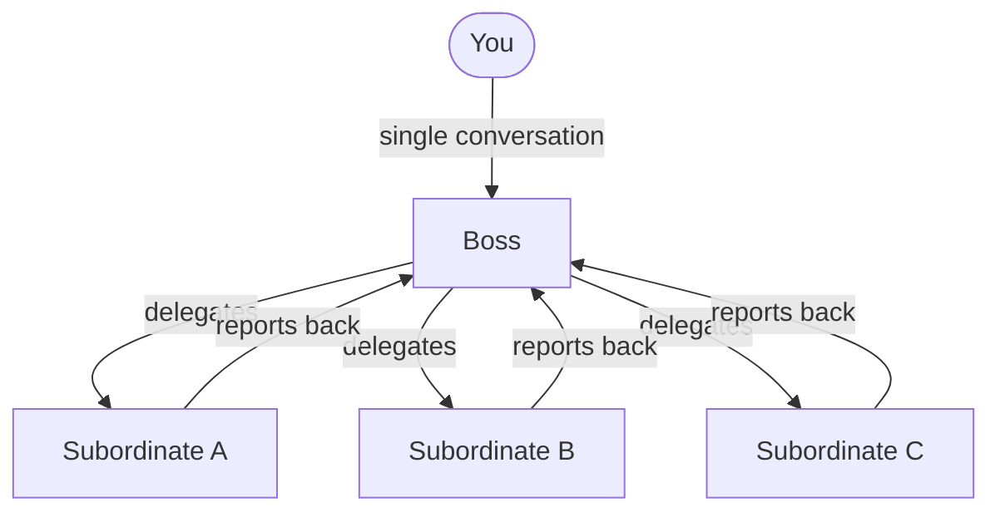

import { Aside, Card, CardGrid } from '@astrojs/starlight/components';

A **Boss agent** is a regular agent with one extra capability: it holds persistent context on the other agents assigned to it. Instead of you tracking which terminal is working on what, you talk to the Boss — it knows the whole team's state and decides who to dispatch.

## The relationship

When you spawn a Boss you assign subordinates from the existing agent pool. The Boss receives a continuously-updated context block containing:

- Each subordinate's name, ID, and current status (`idle`, `working`, `blocked`, `need-review`)
- Their last assigned task and how long ago it was sent
- Their recent file activity (last 20 files read or written)
- Their most recent reply

This context is injected at the top of every Boss turn so it always has a current picture of the team without you needing to summarise anything.

## What makes a Boss different

A normal agent is reactive — you send it a task and it works. A Boss is a coordinator:

| Normal agent | Boss agent |
|---|---|
| One working directory, one task at a time | Aware of the whole team's work |
| You write the task | Boss writes tasks for subordinates |
| Outputs go to your conversation | Subordinate outputs reported back to Boss |
| No knowledge of other agents | Full team context on every turn |

The Boss class also carries the [Boss Instructions skill](/concepts/skills/) which defines the delegation protocol: zero-questions dispatch, structured work-plan format, parallel delegation strategy, and completion reporting.

## Spawning a Boss

You assign subordinates at spawn time from the Spawn Boss Agent modal. Any existing agent can be made a subordinate — it doesn't need to be idle or a specific class.

<Aside type="tip" title="Boss Building">
The Boss Building provides a 3D building on the terrain that acts as a visual hub for the boss's team. Agents assigned to the boss can physically cluster around it on the battlefield. See [Buildings](/buildings/boss-building/).
</Aside>

## Subordinate tracking

Subordinates automatically report their tracking status back to the Boss context via API calls (driven by the Agent Tracking skill). The Boss sees real-time updates:

- `working` — currently processing a task
- `need-review` — finished, waiting for your sign-off
- `blocked` — stuck, needs input or a dependency resolved
- `waiting-subordinates` — (nested Boss) waiting on its own team
- `can-clear-context` — fully done, safe to compact

<CardGrid>
  <Card title="Delegation" icon="forward-slash">
    How the Boss dispatches tasks and receives results. See [Delegation](/concepts/delegation/).
  </Card>
  <Card title="Classes" icon="seti:config">
    The Boss class and what makes it different from other built-in classes. See [Classes](/concepts/classes/).
  </Card>
</CardGrid>
