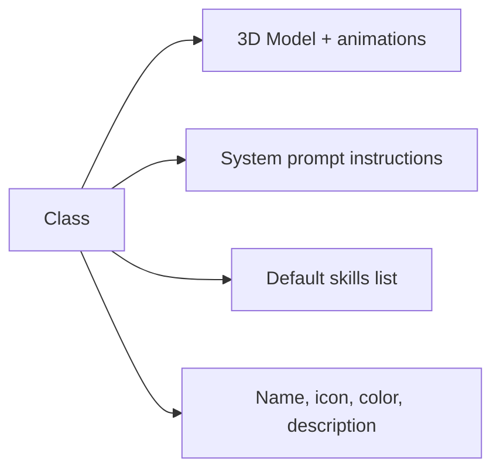

import { Aside, Card, CardGrid } from '@astrojs/starlight/components';

A **class** is a reusable template that bundles three things: a 3D character model, a set of default instructions, and a set of default skills. When you spawn an agent you pick a class; the agent inherits everything in that bundle immediately.

Classes are cosmetic by default — a Scout and a Builder run the exact same underlying CLI process. The class only affects what the agent looks like on the battlefield and what instructions + skills it starts with. To make a class behave differently, add custom instructions or skills to it.

**Exception**: the **Boss** class is not cosmetic. Agents assigned the Boss class can have subordinates and gain the delegation system.

## Built-in classes

Tide Commander ships seven classes:

| Class | Default role |
|-------|-------------|
| **Scout** | Exploration, research, codebase surveys |
| **Builder** | Feature implementation, scaffolding |
| **Debugger** | Bug investigation, log analysis |
| **Architect** | System design, planning, architecture reviews |
| **Warrior** | Aggressive refactors, migrations, deletions |
| **Support** | Documentation, test writing, review |
| **Boss** | Team coordination and delegation |

There are 12 built-in 3D character models (6 male, 6 female) shared across these classes.


## What a class definition contains



- **3D Model** — A GLB file with idle, walk, and working animation states. Built-ins use shared models; custom classes can upload their own.
- **Instructions** — Markdown text injected into the system prompt for every agent of this class. Layered above the global System Prompt but below Tide Commander's base rules.
- **Default skills** — Skills automatically assigned to all agents of this class at spawn time.
- **Meta** — Name, emoji icon, accent color used in the UI.

## Prompt layering

Class instructions sit in the middle of the five-layer prompt stack:

```
1. Tide Commander base rules (always present)
2. Global System Prompt (Settings → System Prompt)
3. Class instructions  ← this layer
4. Individual agent instructions
5. Skills + Agent Identity
```

<Aside type="tip" title="Make classes opinionated">
The most useful classes have strong instructions — role-specific rules like "always write tests", "never modify production config", or "read the CLAUDE.md before any task". Blank classes with no instructions behave identically to any other blank class.
</Aside>

## Custom classes

You can create your own classes from the **Classes** tab in the Skills panel. Custom classes support everything the built-ins support, plus the ability to upload a custom GLB model with your own animation mapping.

<CardGrid>
  <Card title="Custom Classes & 3D Models" icon="pencil">
    Full authoring guide — GLB upload, animation mapping, scale, offset. See [Custom Classes](/advanced/custom-classes/).
  </Card>
  <Card title="Skills" icon="puzzle">
    What skills are and how they layer on top of class instructions. See [Skills](/concepts/skills/).
  </Card>
</CardGrid>
