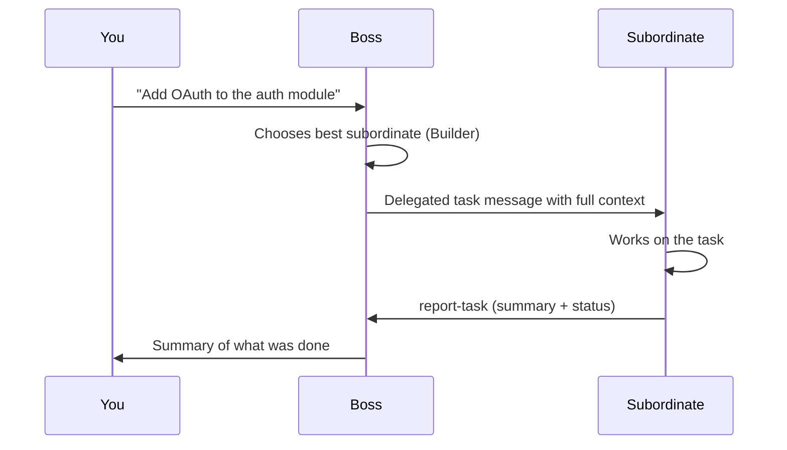

import { Aside } from '@astrojs/starlight/components';

**Delegation** is the mechanism by which a Boss agent assigns a task to a subordinate, hands it the right context, and receives a structured completion report when it is done. From your perspective: you write one message to the Boss; it figures out who should handle it and dispatches.

## How it works



Delegation happens in three steps:

1. **Dispatch** — The Boss emits a structured delegation payload in its reply. Tide Commander parses this and forwards the task to the named subordinate as a new conversation turn. The task message includes who delegated it, the user's original request, and any contextual notes the Boss added.

2. **Execution** — The subordinate works normally. It doesn't know it's being orchestrated; it just receives a task message with `[DELEGATED TASK from boss "..."]` in the header.

3. **Report** — When the subordinate finishes, it calls `POST /api/agents/<id>/report-task`. Tide Commander routes this back to the Boss's context so the Boss can summarise results for you.

## What the subordinate receives

A delegated task message looks like this:

```
[DELEGATED TASK from boss "My Boss" (abc123)]

Add OAuth2 support to the auth module. Use the existing
SessionService for token storage. Scope: backend only.

---
This task was delegated by your boss agent. When you finish, report
completion using:
curl -s -X POST http://localhost:5174/api/agents/YOUR_ID/report-task ...
```

The header and footer are injected by Tide Commander. The body is whatever the Boss wrote.

## Parallel delegation

A Boss can delegate to multiple subordinates in a single turn — for example, sending a research task to one agent and a scaffolding task to another simultaneously. The Boss then waits (`trackingStatus: waiting-subordinates`) until both report back before synthesising a combined result.

<Aside type="note" title="Zero-questions policy">
The Boss Instructions skill enforces a no-clarification rule: dispatch immediately with reasonable assumptions rather than asking you to elaborate. If a subordinate later hits an ambiguity, it either resolves it autonomously or reports back blocked.
</Aside>

## Tracking delegation in flight

The Boss Inspector's **Team** tab shows which subordinates have active tasks, their current status, and when they last reported. You can also see this on the Tracking Board view — each subordinate appears with its tracking status badge.


## Work plans

Before delegating, a Boss may emit a **work plan** — a structured JSON code fence (` ```work-plan `) rendered by the UI as a phased execution plan. This lets you see exactly what the Boss intends to delegate before it dispatches. Work plans are conceptual previews, not binding contracts; the Boss adjusts them based on what subordinates actually report.
