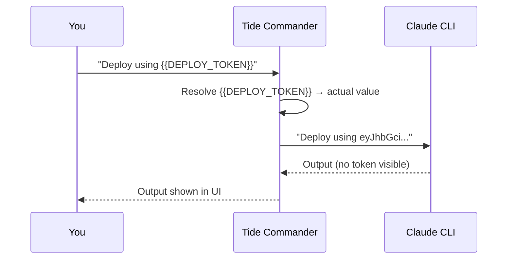

import { Aside } from '@astrojs/starlight/components';

**Secrets** let you store API keys, tokens, and passwords on the server and reference them in agent commands using `{{PLACEHOLDER}}` syntax. The server resolves placeholders before the text is sent to the CLI — so the real value never appears in conversation history, session files, or logs.

## How it works



The resolution happens server-side. The token is in memory only for the duration of the substitution.

## Placeholder syntax

```
{{SECRET_KEY}}
```

Keys are uppercase with underscores. Examples:

```bash
curl -H "Authorization: Bearer {{GITHUB_TOKEN}}" https://api.github.com/user

deploy.sh --token {{DEPLOY_TOKEN}} --env {{ENV_NAME}}
```

## Where placeholders are resolved

Placeholders are substituted in three places:

| Location | Example |
|---|---|
| Agent commands | Any message you send to an agent |
| Skill instructions | Before skills are injected into the system prompt |
| Streaming exec commands | `POST /api/exec` requests |

Placeholders in agent replies (things the agent writes back to you) are **not** resolved — the agent never sees the raw secret value.

## Encryption at rest

Secrets are stored in `~/.local/share/tide-commander/secrets.json` encrypted with **AES-256-GCM** using a machine-specific key derived from hardware identifiers. A secrets file from one machine cannot be decrypted on another — plan accordingly when migrating servers.

<Aside type="caution" title="Machine-bound encryption">
Exporting your Tide Commander config and importing it on a new machine will not migrate secrets. You'll need to re-enter them manually on the new machine.
</Aside>

## Managing secrets

Open **Settings → Secrets** to create, edit, or delete secrets. Each secret has:

- **Name** — human-readable label shown in the UI.
- **Key** — the placeholder identifier, auto-normalised to `UPPER_SNAKE_CASE`.
- **Value** — the actual credential (write-only after creation).
- **Description** — optional notes.


Keys must be unique. Attempting to create two secrets with the same key will fail.
