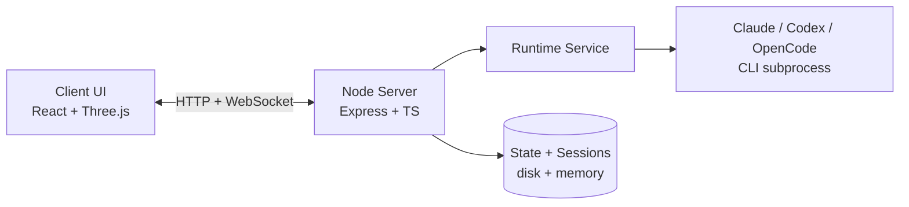
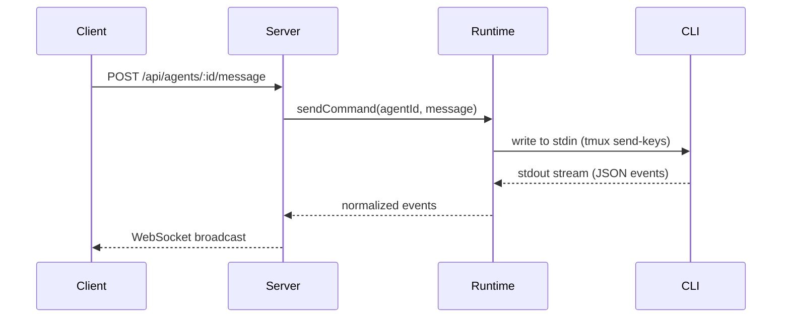
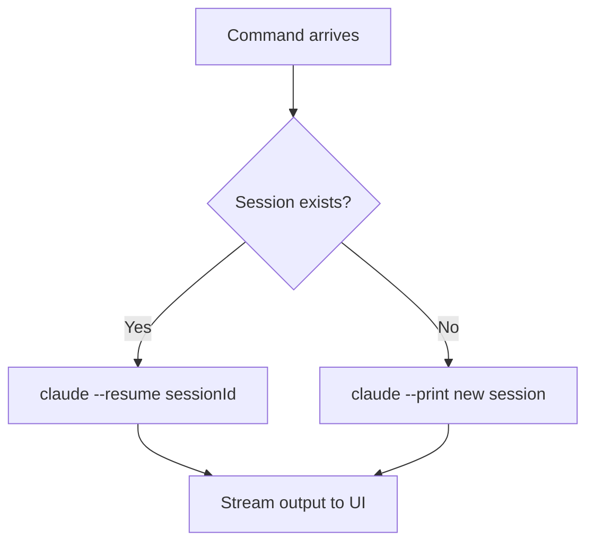

import { Aside } from '@astrojs/starlight/components';

Tide Commander is a three-tier system: a React + Three.js client, an Express + TypeScript server, and one or more CLI subprocesses (Claude Code, Codex, OpenCode). The server is the only component that knows about agents — the client is a pure view layer.

## System overview

- **Client** — served as a static SPA, communicates entirely over HTTP REST and WebSocket. Knows nothing about agent processes.
- **Server** — owns all agent state (spawning, tracking, context, session IDs). Exposes a REST API and a WebSocket for real-time streaming.
- **Runtime Service** — manages the lifecycle of each CLI subprocess via tmux sessions. Reads stdout line-by-line, parses provider-specific JSON event streams, and translates them into a normalized internal event format.
- **CLI** — the actual AI process. The server writes to its stdin and reads from stdout. Each agent is one tmux session.

## Command execution flow

## Session resume

Sessions are stored by the CLI provider on disk (Claude: `~/.claude/projects/`). On agent restart or server reboot, the runtime spawns a new subprocess with `--resume <sessionId>` so the model receives the full prior conversation.

## Watchdog & auto-restart

Each agent's tmux session is monitored by a watchdog. If the session disappears (process crash, OOM kill, terminal closure), the watchdog detects it within seconds and auto-restarts the agent up to three times, resuming the session each time.

A separate stdin watchdog fires if an agent receives a message but produces no output within 10 seconds — this catches frozen processes that are alive but unresponsive.

## Event normalization

Different providers emit different JSON event schemas. The runtime normalizes all of them into a common internal format before broadcasting to the client:

| Internal event | Claude source | Codex source |
|---|---|---|
| `text` | `content_block_delta` | `item.completed` (agent_message) |
| `tool_start` | `tool_use` block start | `item.started` (web_search) |
| `tool_result` | `tool_result` | `item.completed` |
| `step_complete` | `message_stop` | `turn.completed` |
| `usage_snapshot` | `usage` field | `usage` in turn.completed |

<Aside type="note" title="Codex event reference">
The full Codex event schema observed in production is documented in [Codex JSON Events](/reference/codex-events/).
</Aside>

## Data storage

All persistent data lives under `~/.local/share/tide-commander/`. Agent state (positions, names, classes, session IDs) is written to a SQLite database. Skills, secrets, and the system prompt are stored as JSON files. See [Data Storage](/reference/data-storage/) for the full layout.
